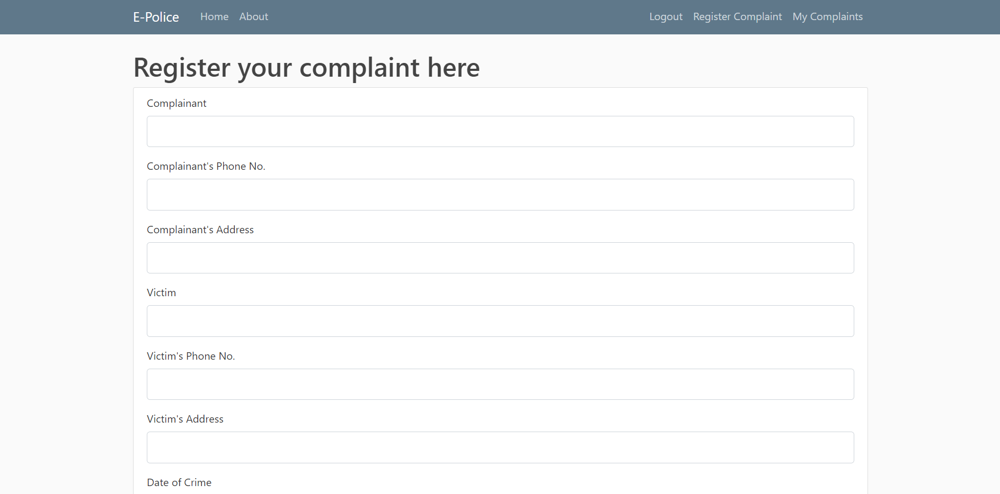

# E-Police
This is an e-police compaint portal. Users may register themselves after which they can file a complaint and view their list of complaints. The administrator of the website can view all the complaints and address them accordingly
Modules:
When the user first logs into the website, he/she is greeted by our home page which gives them a brief regarding the crime taking place in their area in the form of an image carousel.
A navigation bar on the top guides him or her through the different pages of the website.
(home page)
The system comprises of 2 major modules with their sub-modules as follows:
1.	Administrator:
●	Login: Admin can login in his personal account using id and password. In the main login page we have provided an option for only admins to login. This page prevents normal users from logging in. Logging into the admin account gives access to  all registered complaints.

●	View Complaints: Admin can view the complaints. Buttons are provided on each complaint card for updation and deletion.

●	Update cases: Admin can update the crime cases.

●	Deletion: Delete Completed or Invalid Cases

2.	User:
●	User Registration: User has to register to file complaints, crimes or missing report. He/She can do so using their email ID. During registration, the user must provide a unique Email-ID.  
User login page
 
Registration page
 
●	User Login: Once the user is logged into their account, they can view complaints registered by them on the ‘My Complaints ’ page. 

My complaints
 
●	Complaint Registration: If the user hasn’t  already registered a complaint or wishes to register another one, he/she can use the complaint form. This has fields for Complainant,Victim and Accused details, IPC Sections, and a file upload section for uploading images of official documents and pictures of evidence if available.(File upload button is currently non-functional due to limited knowledge in storage of Large Binary in SQLite databases.  )
Register complaint 

Implementation details:
The front-end of the website is made using Bootstrap Template which provides attractive UI for user friendly user interaction, providing easy access to any user.
The backend for this website is provided using Flask which is a Python  framework. Flask is chosen for backend because of its easy implementation.
Flask is a web application framework written in Python. Flask is based on the Werkzeug WSGI toolkit and Jinja2 template engine. Jinja is a web template engine for the Python programming language and is licensed under a BSD License created by Armin Ronacher. It is similar to the Django template engine but provides Python-like expressions while ensuring that the templates are evaluated in a sandbox. It is a text-based template language and thus can be used to generate any markup as well as source code.

 Flask has many configuration values, with sensible defaults, and a few conventions when getting started. By convention, templates and static files are stored in subdirectories within the application’s Python source tree, with the names templates and static respectively.

WSGI Web Server Gateway Interface (WSGI) has been adopted as a standard for Python web application development. WSGI is a specification for a universal interface between the web server and the web applications.

Every form uses the validator method of WTForm to make sure all fields have been entered. The data is stored within an SQLite3 database which is configured using SQLAlchemy; an open-source SQL toolkit and object-relational mapper (ORM) for the Python programming language released under the MIT License
Packages Included:
●	Render  :
 	To render the output screen, by accessing the urls.html.

●	Wtforms
WTForms is used to work with form data submitted by a browser window. They provide fields for taking in data from the user. They can be rendered using Jinja by adding code to HTML files in {{}} brackets.

●	Flask_Login
Flask-Login provides user session management for Flask. It handles the common tasks of logging in, logging out, and remembering your users’ sessions over extended periods of time.

●	SQLAlchemy
SQLAlchemy is the database used to store the data entered by the user. Whenever the user registers a complaint or updates a complaint, then that specific data is then updated in the database. 

●	HTML5/CSS
HTML and CSS is used to design the User Interface to be interactive. CSS styles the web-page such that it becomes user friendly and attractive for the user.
Advantages
●	The User can register a complaint after giving his credentials. So that no fake complaints can be registered.
●	 The user is allowed to file any number of cases. 
●	Gets rid of the need to do paperwork
●	Invalid Cases may be straight away dismissed by the administrator

Application	

●	This system can be used by  multiple people online. This system can be linked to each police station. This will lead to a streamlined storage method for criminal data. Since data is created and managed by the same software,  sharing among police stations becomes easy. This system can also be supported for regional and local languages

Conclusion :
●	We have developed a robust website using the Flask Framework. Each page of the website is linked with one another with no loose ends.
●	The front end is managed by CSS for styling
●	The backend operations such as rendering html templates,  site routing, data storage and retrieval from the database is handled by Python
●	Jinja Templates are used to render templates and interface data between front end and back end.
●	Future Scope:
Host the website on a server.
Add functionality for uploading images while submitting complaint form.
Security and backup for database.

UI Screenshots
Admin Login

 

 

